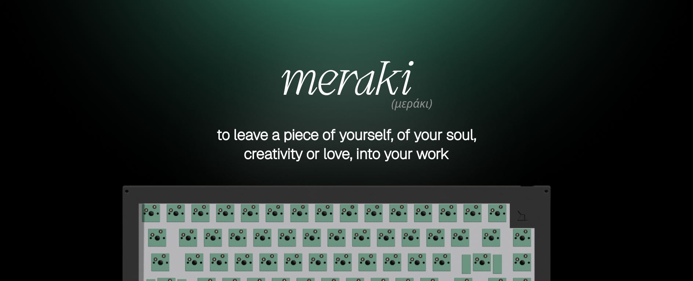
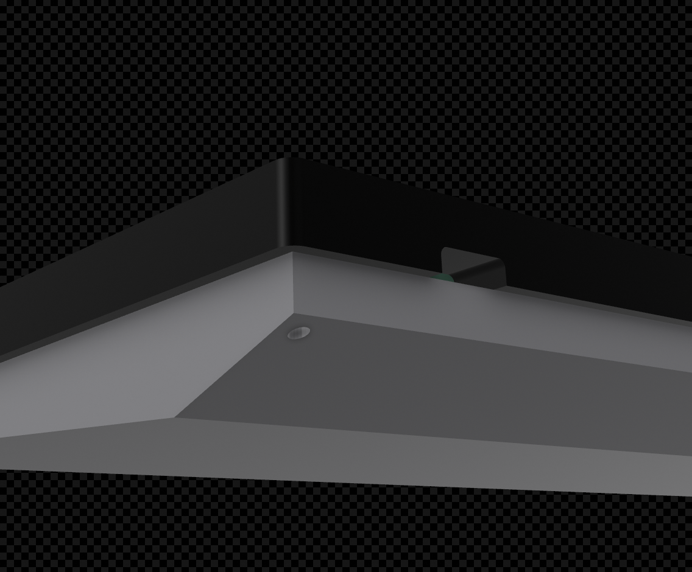
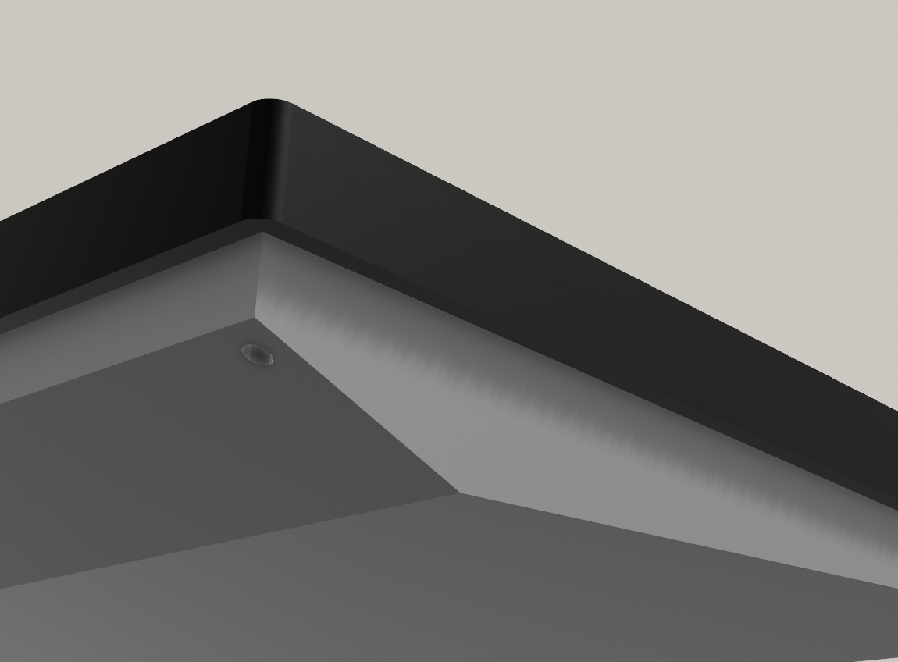
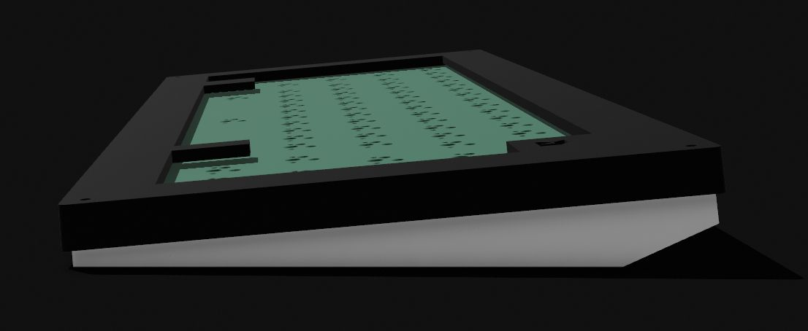
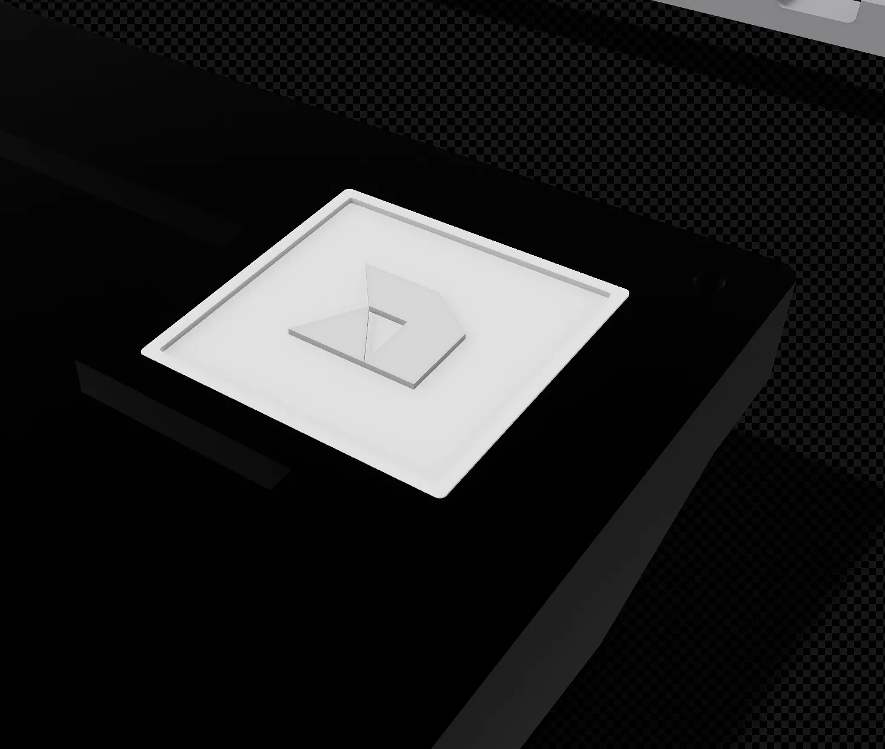
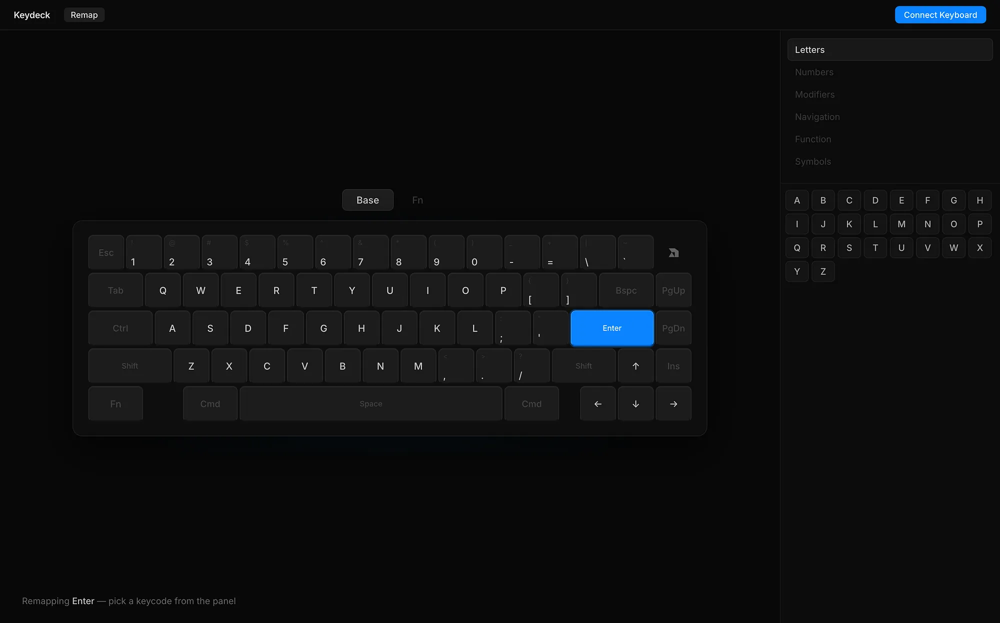
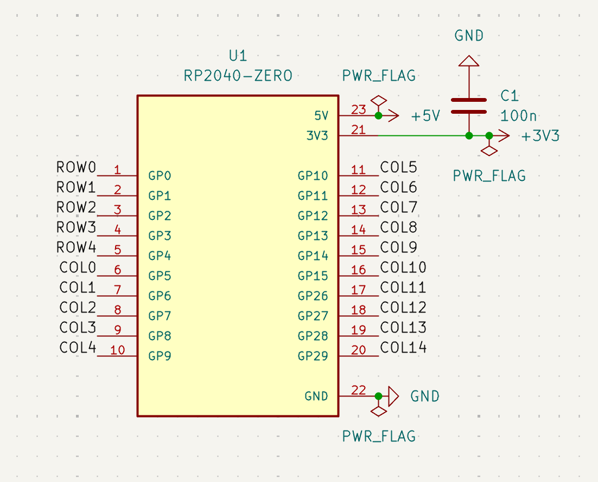
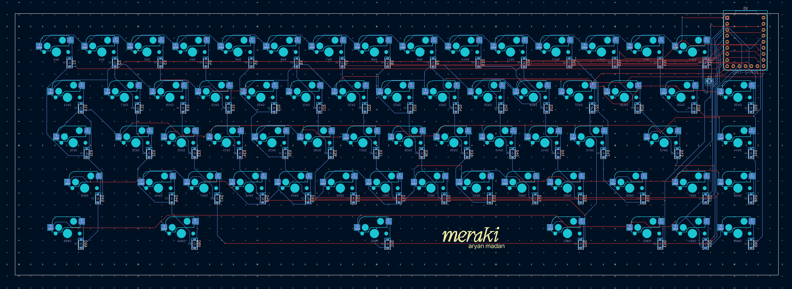

  
  

.png)

  
  

# Name

Meraki, is a greek word that means 'to do something with soul, creativity, or love; leaving a piece of yourself in what you do'.

# Layout 

The keyboard has a 65% WKL Layout. WKL stands for win-key-less, where the Windows key is removed from the keyboard, to give it a more symmetrical shape. WKL's are rarely seen in 65% form, which inspired me to make this board. I also opted for a blocker at the top right to fit the MCU.

# Firmware

The Meraki65 uses qmk for its firmware.
I also created a web-based software to re-map keys, called [Keydeck](https://keydeck.xyz).

# PCB

## Schematic

.png)

## PCB

# Bill of Materials

Total Cost: **9,792** (~$106.38 USD)

## Case

https://app.shapr3d.com/p/29c12f4c-3f33-421a-806f-35c27462d305
To be 3d printed by the Printing Legion.

## Parts

| Piece | Brand | Quantity | Cost (INR) | Cost (USD) | Link |
|-------|-------|----------|-----------|-----------|------|
| Plate Mount Stabilizers | Durock | 1 set | 380 | ~$4.13 | [Link](https://www.genesispc.in/products/durock-plate-mount-stabilizers-6-25u-4x2u-black?variant=43129560924213) |
| Y2 Switches | Keygeek | 70 | 2240 | ~$24.35 | [Link](https://keyora.store/products/keygeek-y2-linear-switch) |
| Gummy-O-Ring Mount | NeoMacro | 1 | 650 | ~$7.00 | [Link](https://neomacro.in/products/neo65-spare-parts-pre-order?variant=46159065415958) |
| M2 x 12mm Screws | Generic | 2 | — | — | - |
| M2 x 10mm Screws | Generic | 2 | — | — | - |
| **Total** | | | **3522** | **~$38.22** | |

## PCB

| Part | Brand | Quantity | Cost (INR) | Cost (USD) | Link |
|------|-------|----------|-----------|-----------|------|
| Printing | JLCPCB | 5(min) | 3403 | ~$37.00 | [Link](https://jlcpcb.com/) |
| RP 2040 Zero | Robu | 1 | 235 | ~$2.55 | [Link](https://robu.in/product/rp2040-zero-for-raspberry-pi-microcontroller-with-soldering/) |
| Hotswap Sockets | Kailh | 100(min) | 532 | ~$5.78 | [Link](https://meckeys.com/shop/accessories/keyboard-accessories/key-switches/kailh-hot-swap-socket/) |
| Diodes | — | 100(min) | 100 | ~$1.09 | [Link](https://www.amazon.in/dp/B084ZP5BJ3?ref=cm_sw_r_cp_ud_dp_YPW3WFYTE31QA18570D1&social_share=cm_sw_r_cp_ud_dp_YPW3WFYTE31QA18570D1&_encoding=UTF8&psc=1) |
| **Total** | | | **4270** | **~$46.42** | |

## Decoration

| Part | Brand | Quantity | Cost (INR) | Cost (USD) |
|------|-------|----------|-----------|-----------|
| Keycaps | Clones | 1 set | 2000 | ~$21.74 |
| **Total** | | | **2000** | **~$21.74** |